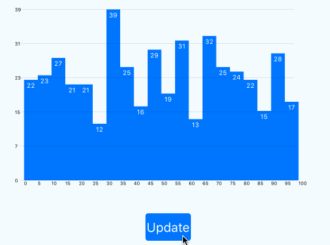

react-native-histogram
===

> histogram component for React Native

[]()[]()

[](https://nodei.co/npm/react-native-histogram/)


Demo
---



Installation
==

in Cli
---
```
npm i react-native-histogram
```

in JavaScirpt
---
```
import Histogram from 'react-native-histogram';
```


Usage
===

```
var HistogramExample = React.createClass({
  getInitialState: function() {
    return {data: [{}]}
  },
  componentWillMount: function() {
    var row_datas = [];
    for (var i=0; i<500; i++) {
      row_datas[i] = Math.random() * 100;
    }
    this.setState({
      data: [{ data: row_datas }]
    })
  },
  render: function() {
    return (
      <View style={styles.container}>
        <View>
          <Histogram
            data={this.state.data}
            height={200}
            width={300}
            split={20}
          />
        </View>
      </View>
    );
  }
});

```

Simple
---
```
<Histogram data={this.state.data} />
```

Props
===

data(Array) `Default: []`
---
The value of histogram like a `[{data: [10, 13, 8, 19, 17]}]`


TODO
===
- [x] show simple histogram
- [x] show values
- [ ] show balloon
- [ ] show multiple historgams
- [ ] show unit


Contributing
==
Of course! Welcome :)


License
==
MIT

